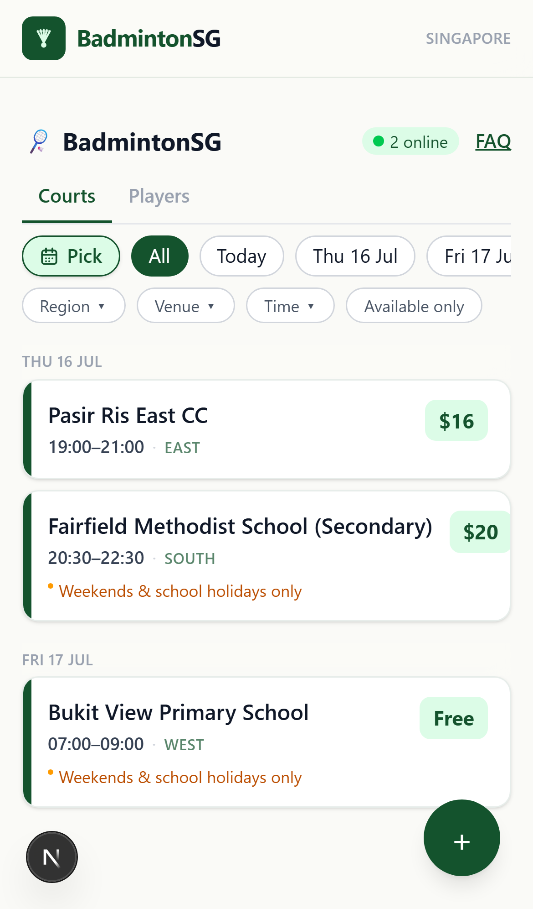
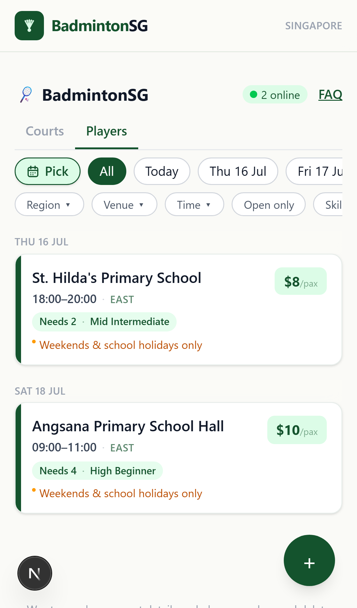
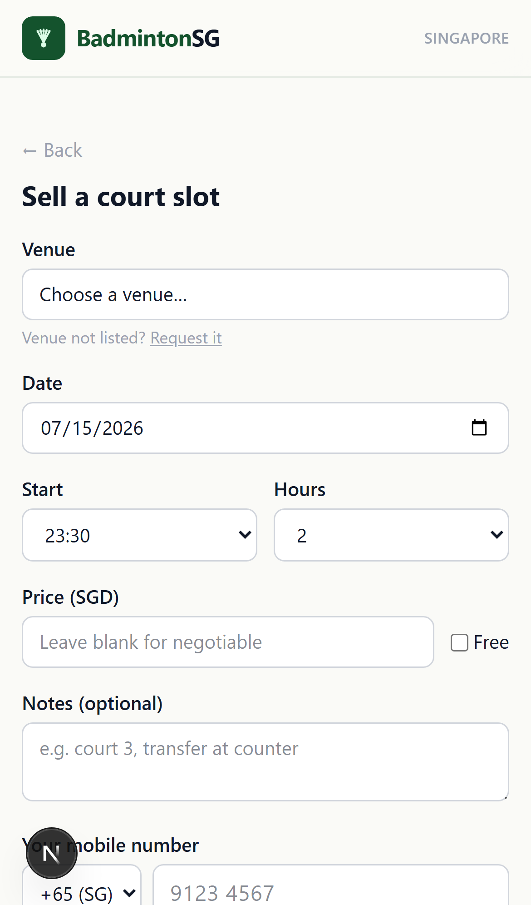
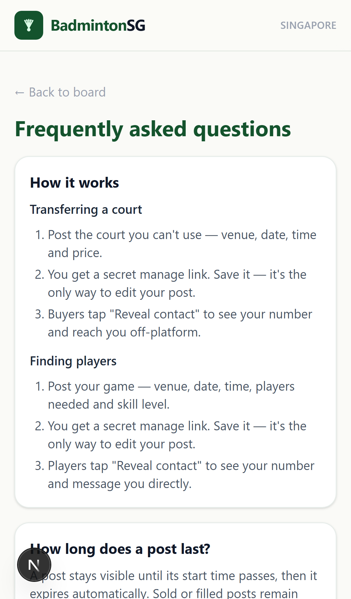

# BadmintonSG

A mobile-first, no-account board where Singapore badminton players **resell balloted court
slots they can't use** and **find players for their games**. It replaces the "post into a
Telegram group and hope someone scrolls past it" workflow with a searchable, filterable board.

**[Try it live →](https://badminton-courts-sable.vercel.app/)**

- **Courts** — a seller posts a court slot (venue, date, time, price); a buyer browses,
  filters, opens a listing, reveals the seller's phone, and contacts them directly.
- **Players** — a host posts a game that needs players (venue, date, skill level, cost per
  player); players find it the same way.

Everything after the match — payment, coordination — happens off-platform over the phone/WhatsApp.
There are no accounts, no payments, and no chat inside the app.

---

## Screenshots

<table>
<tr>
<td></td>
<td></td>
<td></td>
<td></td>
</tr>
<tr>
<td align="center">Courts board</td>
<td align="center">Players board</td>
<td align="center">Post a court</td>
<td align="center">FAQ</td>
</tr>
</table>

---

## Why it exists

In Singapore, courts at ActiveSG sports halls, community centres, and Dual-Use-Scheme school
halls are balloted weeks ahead. People who win a slot they can't use resell it in Telegram
groups, where listings get buried and buyers must scroll endlessly asking "is this still
available?". Players who *have* a court but not enough people face the same mess. BadmintonSG
turns both into a structured, filterable board that answers "what's available this Saturday
in the west?" in one tap.

**Design philosophy:** the fastest possible path from "I have/need a court" to "here's a phone
number to call". No sign-up friction, no login, used courtside on a phone.

## How it works

1. **Post** — a seller lists a court slot, or a host lists a game that needs players. No
   account needed — posting instantly gives you a private "manage link" that's the only way to
   edit or close that post later.
2. **Browse** — anyone can filter the board by date, region, venue, time, and (for games)
   skill level, without seeing anyone's phone number.
3. **Reveal** — tapping "Reveal contact" on a listing shows the poster's phone number, with
   one-tap `tel:` and WhatsApp links.
4. **Connect off-platform** — the rest (payment, meeting up, confirming) happens over the
   phone or WhatsApp, the same way it always has.

See the [FAQ](https://badminton-courts-sable.vercel.app/faq) for post lifespans, editing, and
what data is stored.

---

## For developers

Tech stack, architecture, local setup, and deployment live in
**[docs/DEVELOPMENT.md](docs/DEVELOPMENT.md)**.
