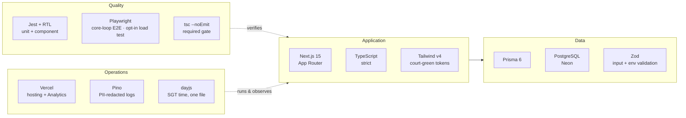
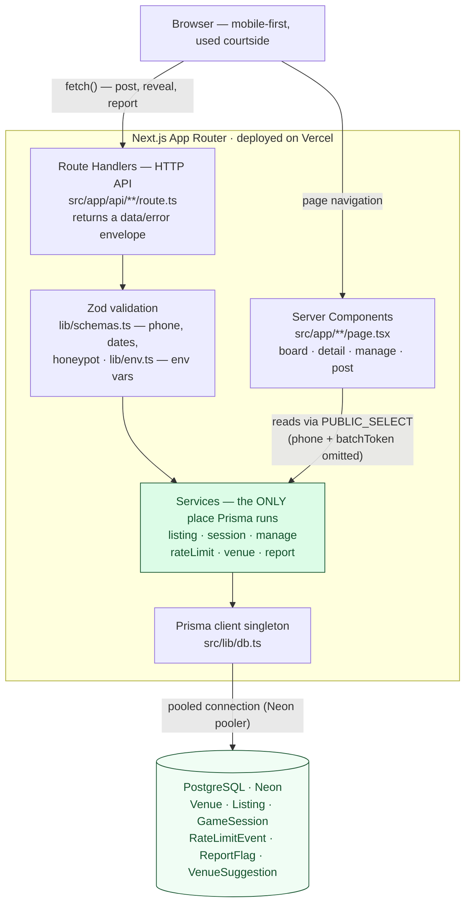
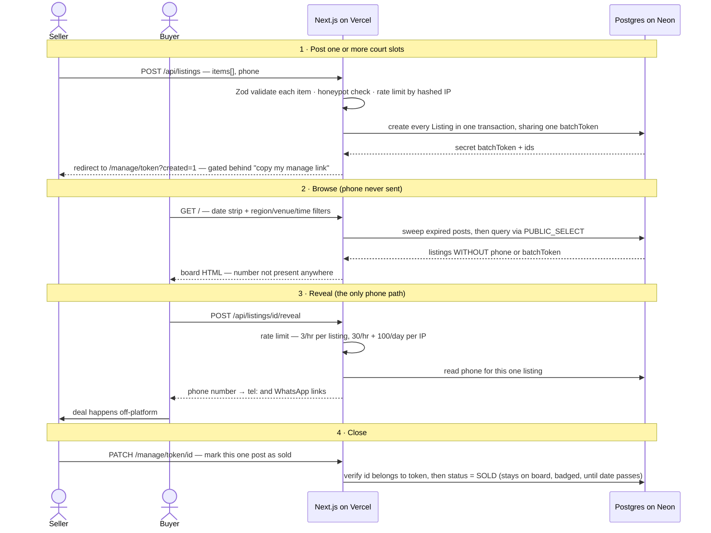

# BadmintonSG — Technical Docs

For what the app is and why it exists, see the main [README](../README.md). This doc covers
the tech stack, architecture, local development, deployment, and testing.

---

## Tech stack

| Layer | Choice | Why |
|---|---|---|
| Framework | **Next.js 15** (App Router) | Server components for the board (fast, SEO-able), route handlers for the API, one deploy target |
| Language | **TypeScript** (strict) | Type-safe end to end; `npx tsc --noEmit` is a required gate |
| Styling | **Tailwind CSS v4** | Utility-first, mobile-first; custom tokens `court`/`court-light`/`paper` |
| ORM / DB | **Prisma 6 + PostgreSQL** (Neon) | Typed queries, migrations; Postgres-backed rate limiting (no Redis) |
| Validation | **Zod** | One schema layer for API input **and** environment variables |
| Dates/time | **dayjs** (utc + timezone) | Confined to `src/lib/time.ts`; all court times are SGT wall-clock |
| Logging | **Pino** | JSON logs to stdout with `phone`/`batchToken`/`url` redaction |
| Errors | **Sentry** (`@sentry/nextjs`, errors-only) | Client crashes + unexpected 500s; Vercel Hobby keeps runtime logs ~1h, so pino alone can't alert on production failures. Inert until `NEXT_PUBLIC_SENTRY_DSN` is set (free sentry.io project → copy DSN → Vercel env var, Production scope) |
| Tests | **Jest + React Testing Library + Playwright** | Unit + component + one end-to-end core-loop |
| Analytics | **Vercel Analytics** | Free, privacy-light traffic measurement |
| Hosting | **Vercel + Neon** | Both free tiers cover ~1,000 users/day at $0/mo; Neon auto-wakes on query, no manual resume |



---

## Architecture

The app is a single Next.js project with a strict internal boundary: **all database access
lives in `src/services/`; route handlers and pages only validate, call a service, and shape
the response.** This keeps the data logic testable and phone numbers structurally contained.



Two structural guarantees fall out of this shape:

- **Phone containment** — pages and list APIs can only read through `PUBLIC_*_SELECT`
  projections that omit `phone`/`batchToken`, so a scraper can't find a number anywhere
  except the rate-limited reveal endpoint.
- **Testability** — every service is a plain async function against Postgres, tested
  directly without HTTP.

### Directory map

```
src/
  app/
    page.tsx                 Board homepage (Courts | Players tabs, date strip, filters)
    listing/[id]/page.tsx    Court detail + click-to-reveal
    session/[id]/page.tsx    Game detail + click-to-reveal
    post/                    Chooser + court form + game form (repeatable entries, one manage link;
                               also reused to append more posts to an existing manage link)
    manage/[token]/page.tsx  Secret manage page — lists every post in the batch (edit, mark sold/
                               filled, revert, delete, add another court/game to the same link)
    venue-request/page.tsx   "Request a venue" form
    api/                     14 route handlers (listings, sessions, manage, venues, suggestions, presence)
  components/                Cards, BottomSheet, DateStrip, FilterBar, VenuePicker, RevealButton, …
  services/                  All Prisma queries live here
  lib/
    env.ts                   Zod-validated environment variables
    db.ts                    Prisma client singleton (pooling-safe)
    time.ts                  SGT wall-clock time (the only dayjs user)
    schemas.ts                Zod input schemas + honeypot + phone validation
    ip.ts                    Salted IP hashing
    api.ts                   { data, error } envelope + error→status mapping
    logger.ts                Pino with PII redaction
prisma/
  schema.prisma              7 models
  venues.json                463 seeded venues (ActiveSG halls, CCs, DUS schools, and a
                               handful of well-known private venues under OTHER)
  seed.ts                    Idempotent upsert-by-name seeder
scripts/
  loadTestSeed.ts            Seeds/cleans tagged load-test courts+games (local or prod)
e2e/                         Playwright core-loop happy path (part of CI)
e2e-load/                    Playwright load test — opt-in only, see Testing
```

### Data models

- **Venue** — name, address, postalCode, region (NORTH/SOUTH/EAST/WEST/CENTRAL), venueType
  (SPORTS_HALL/COMMUNITY_CENTRE/SCHOOL/OTHER), optional availabilityNote (e.g. schools:
  "Weekends & school holidays only").
- **Listing** (a court for sale) — venue OR customVenueName+customRegion (a venue not in our
  curated list — mutually exclusive, enforced by the create schema), date, start/end time,
  priceCents (`0`=free, `null`=negotiable), notes, **phone and/or telegramHandle** (at least one
  required — a poster can share just a Telegram handle if they'd rather not give a number),
  status (AVAILABLE/SOLD/EXPIRED), and a **batchToken** (not unique — every post created in the
  same submission shares one, which is the manage link).
- **GameSession** (a game seeking players) — like Listing plus playersNeeded, skillMin/skillMax
  (a skill-level range), pricePerPlayerCents; status OPEN/FILLED/EXPIRED.
- **RateLimitEvent** — hashed IP + action + optional target, for Postgres-backed rate limiting.
- **ReportFlag** — abuse reports (idempotent per hashed IP).
- **VenueSuggestion** — "venue not listed" requests.

### How data flows (a court transfer, end to end)



1. **Post** — a seller fills the court form, optionally adding several courts with
   "+ Add another court", then submits once → `POST /api/listings` with an `items[]` array.
   Zod validates every item (date within today→+8 weeks, honeypot empty). The route
   rate-limits by hashed IP once per request, then `listingService.createListingBatch` writes
   all rows in one transaction, sharing a single secret `batchToken`.
2. **Success = manage link** — the browser lands on `/manage/<batchToken>?created=1`, which
   gates the mark-sold/edit/delete controls behind an explicit "copy my manage link" click —
   that URL is the *only* way to manage any post in the batch (no login), so the click forces
   the poster to save it before they can do anything else.
3. **Browse** — a buyer opens `/` (server component). `listingService.listListings` runs an
   on-read sweep (expire past posts, scrub old phones/handles) — time-gated to at most once
   per instance per minute, so busy traffic doesn't fire the sweep's write statements on
   every view — then returns rows (capped at 500 as a DoS guard) via
   `PUBLIC_LISTING_SELECT` — a select that **structurally omits `phone`/`telegramHandle` and
   `batchToken`**, so contact info never reaches the browser. The venue's address (curated
   venues only) is included so the detail page can link out to Google Maps — no coordinates are
   stored, it's a `maps.google.com/search?query=<name>,<address>` link built on read
   (`lib/venue.ts`'s `resolveVenueDisplay`).
4. **Reveal** — on the detail page the buyer taps "Reveal contact" → `POST
   /api/listings/[id]/reveal`. This endpoint is rate-limited (per IP+listing and globally) and
   is the *only* path that returns phone/Telegram. The UI shows whichever the poster gave —
   `tel:`/WhatsApp deep links for a phone, a `t.me/<handle>` link for Telegram, both if both
   were given.
5. **Manage** — the seller opens their manage link, which lists every post in the batch. Each
   one has its own Edit (date/time/price/notes, and for games, players needed/skill range),
   "Mark as sold/filled" and its undo "Revert to available/open" (both `PATCH
   /api/manage/[token]/[id]`), and Delete (`DELETE`) — every write re-checks that `id` actually
   belongs to `token` before touching the row. Sold/filled posts stay on the board (badged,
   sorted last) until their date passes, then auto-expire. The manage page also links to
   "+ Add another court/game", which reopens the post form pre-wired to `POST
   /api/manage/[token]/items` — it appends to the same `batchToken` and reuses the batch's
   existing phone, so no phone re-entry and no new manage link.

### Time handling

A court slot is a Singapore wall-clock fact, so court dates/times are **never converted to
UTC**. `date` is a date-only column meaning the SGT calendar date; `startTime`/`endTime` are
`"HH:mm"` SGT strings. All "now" logic goes through `src/lib/time.ts` (the only file that
imports dayjs). `createdAt`/`updatedAt` remain normal UTC machine timestamps.

---

## Security & privacy

- **Phone numbers and Telegram handles never appear in page HTML or list/detail JSON** — only
  the rate-limited reveal endpoint returns them. Enforced structurally by the `PUBLIC_*_SELECT`
  objects (neither column is selected), so a page literally cannot render them. Telegram is
  gated the same way as phone (same reveal rate limit, same 14-day post-expiry scrub) even
  though a public @handle is inherently less sensitive than a number — consistency over
  cutting a corner.
- **Rate limiting** (Postgres-backed, no Redis) — reveal: 3/hr per listing+IP, 30/hr + 100/day
  per IP overall; create (post): 10/hr per IP; report/venue-suggestion: 15/hr per IP; presence
  heartbeat: 300/hr per IP (limits are generous because Singapore mobile carriers use CGNAT,
  sharing IPs). See `src/services/rateLimitService.ts` for the source of truth.
- **Anti-spam** — hidden honeypot field (a filled `website` field silently returns success
  and writes nothing), phone/Telegram format validation, max 10 active posts per contact
  (phone if given, else Telegram handle — see `batchService.ts`'s `contactWhere`).
- **PDPA-minded** — IPs are stored only as salted SHA-256 hashes; phone numbers are scrubbed
  14 days after a post expires; the footer states exactly what's retained.
- **Manage links** — unguessable UUID tokens, `noindex` meta + `X-Robots-Tag` header, and
  Pino redaction so tokens/phones never hit logs.
- No `dangerouslySetInnerHTML` anywhere; Prisma parameterises all queries.

---

## Local development

**Prerequisites:** Node 18+, Docker Desktop (for local Postgres), npm.

```bash
# 1. Install dependencies
npm install

# 2. Start a local Postgres (mapped to host port 5433 to avoid clashing with a native pg)
docker compose up -d

# 3. Configure environment
cp .env.example .env          # values already point at the docker DB on port 5433

# 4. Apply migrations and seed the venues
npx prisma migrate dev
npx prisma db seed

# 5. Run the app
npm run dev                   # http://localhost:3000
```

No Docker? Point `DATABASE_URL`/`DIRECT_URL` in `.env` at any Postgres (e.g. a free
[Neon](https://neon.tech) project) and skip step 2.

### Keeping local dev separate from production

`.env` is what `npm run dev` and plain `npx prisma …` commands read — **always keep this
pointed at your local Docker Postgres**, never at production.

`npm test`/Jest uses the committed `.env.test` instead (Jest runs with `NODE_ENV=test`, which
makes Next's env loader prefer it): the same local Postgres container, but a dedicated `test`
schema. Jest truncates every table between runs, so this isolation is what keeps `npm test`
from wiping whatever data you have in the dev app. The schema is created and migrated
automatically on first run (`jest.global-setup.ts`), and outside CI the setup refuses to run
at all unless the URL points at the test schema.

When you need to run a one-off command against production (e.g. after a schema migration,
before merging a PR), keep those credentials in a separate, gitignored `.env.production.local`
(copy `.env.production.example` for the shape) and use the dedicated scripts instead of editing
`.env`:

```bash
npm run prod:migrate   # npx prisma migrate deploy against .env.production.local
npm run prod:seed      # npx prisma db seed against .env.production.local
```

Both `.env` and `.env.production.local` are gitignored — only the `.example` templates are
committed.

**A real trap here:** `next start` (production mode — what `npm run start` and CI's e2e job
run) resolves `.env.production.local` *ahead of* `.env` if that file exists, regardless of
`NODE_ENV`. On a machine set up for `prod:migrate`/`prod:seed`, a bare `npm run start` would
silently serve — and let you post/reveal/delete against — the real production database. Fixed
structurally: `npm run start` is `dotenv -e .env -- next start`, which injects `.env`'s values
*before* Next boots, and Next's own env loader never overrides an already-set value. The same
issue existed in `e2e/global-setup.ts`, `e2e/core-loop.spec.ts`, and `e2e-load/load.spec.ts`
(all called `loadEnvConfig(process.cwd())` without forcing dev-mode precedence) — all three now
pass `true` explicitly. None of this affects actual Vercel deployments, which never invoke
`npm run start` — Vercel serves the `next build` output through its own runtime and injects env
vars from its dashboard directly, bypassing `.env*` files entirely.

### Environment variables

| Var | Purpose |
|---|---|
| `DATABASE_URL` | Postgres connection. In production: Neon's **pooled** connection string (host ends in `-pooler`) |
| `DIRECT_URL` | Neon's **direct** connection string (host has no `-pooler` suffix) — used by Prisma for migrations |
| `IP_HASH_SALT` | Secret salt for hashing IPs. Generate a fresh one for production: `openssl rand -hex 32` |

`src/lib/env.ts` validates these with Zod at startup, so a missing/malformed var fails fast.

### Commands

```bash
npm run dev              # dev server
npm run build             # prisma generate + production build (pure — never touches a database)
                          # (Vercel deploys run `vercel-build` instead, which adds `prisma migrate deploy`)
npm test                 # Jest unit + component tests (serial, against the dedicated test database)
npm run test:e2e         # Playwright core-loop happy path
npm run test:load        # opt-in: seeds ~300 courts+games and asserts perf ceilings (see Testing)
npx tsc --noEmit         # type-check (Jest uses SWC and does NOT type-check)
npm run lint             # ESLint
npm run prod:migrate     # apply pending migrations to production (Neon)
npm run prod:seed        # reseed venues in production (Neon)
npm run loadtest:seed -- 50       # seed N tagged courts+games locally for manual testing (default 50)
npm run loadtest:cleanup          # remove everything loadtest:seed added, locally
npm run loadtest:seed:prod -- 50  # same, against production — use deliberately, not by habit
npm run loadtest:cleanup:prod     # remove load-test rows from production
```

---

## Deployment (Vercel + Neon)

At ~1,000 users/day both free tiers are comfortable (**~$0/month**). Neon auto-suspends
compute after a few minutes of inactivity and wakes itself on the next query — no manual
"resume" step, unlike Supabase's 7-day pause.

1. **Create a Neon project** (region `ap-southeast-1` / Singapore, if available — otherwise
   the nearest region to your users). From the project dashboard, copy two connection strings:
   - **Pooled connection** (host ends in `-pooler.<region>.aws.neon.tech`) → production
     `DATABASE_URL`.
   - **Direct connection** (same host, no `-pooler`) → production `DIRECT_URL`, used by Prisma
     for migrations.
2. **Save both into `.env.production.local`** (see [Local development](#local-development)
   above), then apply schema + seed once by hand for the initial setup:
   ```bash
   npm run prod:migrate
   npm run prod:seed
   ```
3. **Add the same two connection strings as GitHub Actions secrets** — Settings → Secrets and
   variables → Actions → New repository secret — named `PROD_DATABASE_URL` and
   `PROD_DIRECT_URL`. This is what lets CI apply migrations automatically on every merge (next
   step); skip it and the `migrate-production` job just fails safely (missing secrets), it won't
   touch anything.
4. **Create a Vercel project** from this repo. Set env vars in the Vercel dashboard:
   `DATABASE_URL` (pooled), `DIRECT_URL` (direct), `IP_HASH_SALT` (`openssl rand -hex 32`,
   don't reuse your local dev value), and `CRON_SECRET` (`openssl rand -hex 32`) so the
   daily sweep endpoint only answers to Vercel's scheduler. **Scope all of these to the
   Production environment only** — preview deployments of unmerged PRs must never see the
   production database (this actually happened: prod's `_prisma_migrations` shows branch
   migrations landing an hour before their PRs were merged, applied by preview builds).
   If you want previews to serve real data, give the Preview scope its own separate
   database (e.g. a free Neon branch) instead.
5. **Deploy** (`npx vercel --prod` or push to the connected branch). Vercel runs the
   `vercel-build` script (preferred over `build` when present — see
   `scripts/vercel-build.sh`): `prisma generate`, then `prisma migrate deploy` **only
   when `VERCEL_ENV=production`** (or on previews that explicitly opt in, below), then
   `next build`. The deployed Prisma Client always matches `schema.prisma` and the
   schema is migrated before the new code that expects it goes live — don't drop the
   `prisma generate` step even if it looks redundant with `npm ci`'s own postinstall,
   since a cached `node_modules` on Vercel can otherwise ship a stale client after a
   schema change.

### Working preview deployments (optional)

By default previews build fine but serve no data (no env vars — pages that need the
database show the global error screen). To make preview links fully usable, give the
Preview environment its own isolated database:

1. In Neon: create a branch of the project (e.g. named `preview`) — it gets its own
   pooled + direct connection strings, copy-on-write, and can be reset anytime.
2. In Vercel → Environment Variables, add these scoped to **Preview only**:
   `DATABASE_URL` (preview branch pooled), `DIRECT_URL` (preview branch direct),
   `IP_HASH_SALT` (any random string — NOT the production one), and
   `PREVIEW_DATABASE=1`.
3. That's it — with `PREVIEW_DATABASE=1` present, preview builds migrate the preview
   branch to match the PR's schema and reseed venues (idempotent upsert) on every build.

The `PREVIEW_DATABASE=1` flag is deliberate defence in depth: a production
`DATABASE_URL` accidentally scoped into Preview is not enough to make preview builds
run migrations — that exact mis-scoping is how preview builds once migrated production.
Note all open PRs share the one preview branch, so two simultaneously open PRs with
conflicting schema changes can fight over it — rarely an issue solo, and a branch reset
in Neon fixes it.
6. **Smoke test** on the production URL: post a listing, reveal it from another browser, mark
   it sold, delete it. Confirm `/api/listings` responses contain no `phone` field.
7. **Region latency**: if the app feels slow, check that your Vercel project's function region
   is close to your Neon region (e.g. Singapore `sin1`) — a mismatch adds a cross-region round
   trip to every database query.

> Vercel's Hobby tier is non-commercial — fine while the app is free to use. Growth triggers:
> Neon's paid tier (usage-based, from ~$5) then Vercel Pro ($20), at roughly 10× traffic.

### Migrations deploy automatically, atomically with every Vercel build

`package.json`'s `vercel-build` script (which Vercel runs in preference to `build` when it
exists) runs `prisma migrate deploy` immediately before `next build`. This is the primary
mechanism: every Vercel deploy migrates the database as an inseparable part of that same
build, so there's no window where new code can run against an old schema. The plain `build`
script deliberately does NOT migrate — a local `npm run build` is pure and can never touch a
database as a side effect (on a machine with `.env.production.local`, the old combined script
was one env mixup away from migrating production from a laptop).

A daily Vercel cron (`vercel.json` → `/api/cron/sweep`, 09:00 SGT) runs the same sweep the
board triggers on read. Without it, the FAQ's "phone numbers deleted 14 days after expiry"
promise only held if someone happened to visit — now it holds unconditionally, traffic or not.

`.github/workflows/ci.yml` also has a `migrate-production` job that runs `prisma migrate
deploy` (then reseeds venues) against production, after a **push to `main`** — never on a
pull request — and only after `test`/`e2e` both pass. This is now a defensive backup (e.g. if
a Vercel build is skipped or manually disabled) rather than the primary mechanism — safe to
run twice, since `migrate deploy` is idempotent. This whole setup exists because forgetting to
migrate before/after a merge is exactly what broke production twice (`GameSession`/`Listing`
batch-token migration, then the presence/custom-venue migrations) — the deployed code expected
columns the database didn't have yet.

All schema changes in this repo are additive/backfill-safe regardless (see the migration files
for the pattern: add nullable, backfill, then tighten — never a bare `NOT NULL` on a possibly
non-empty table), so even a hypothetical migration hiccup fails safe as "briefly serves 500s,"
never data loss or corruption.

---

## Testing

- **Jest unit** (`src/**/__tests__`) — services (expiry sweep, rate-limit windows, the
  `phone`/`batchToken` omission from public selects), `lib/time.ts` SGT boundaries, Zod schemas.
  Service tests hit the local Postgres and run serially (`--runInBand`). Note: this truncates
  listings/sessions/venues on the DB `.env` points at between tests — see [Keeping local dev
  separate from production](#keeping-local-dev-separate-from-production); it will also wipe
  any rows you seeded with `loadtest:seed`, so re-seed after running `npm test` if you need them.
- **React Testing Library** — cards, bottom sheet, date strip, venue picker, reveal button.
- **Playwright** (`e2e/core-loop.spec.ts`, part of CI) — 7 scenarios: court post → browse →
  assert phone absent → reveal → mark sold; the same loop for a game; posting two courts in
  one batch; the "add another court" save-link re-gate; posting at a venue not in the curated
  list; posting with only a Telegram handle (no phone); editing a post's contact from phone to
  Telegram. The phone-absence and reveal assertions are the security-critical ones. A
  `beforeEach` wipes listings/sessions/rate-limit-events before *every* test attempt (not just
  once for the whole run) so a failed attempt's leftovers can never bleed into a later test or
  a retry. In CI, `playwright.config.ts` runs this against a production build (`npm run start`)
  instead of `npm run dev`, with 2 retries — locally it's `npm run dev`, retry-free, for fast
  iteration. `playwright.config.ts` also forces the local test database into the server's env
  explicitly (see [Keeping local dev separate from production](#keeping-local-dev-separate-from-production))
  so a local `CI=1` run can never accidentally hit production, regardless of what
  `.env.production.local` happens to contain on your machine.
- **Playwright load test** (`e2e-load/load.spec.ts`, its own `playwright.load.config.ts`) —
  opt-in only (`npm run test:load`), never runs in CI. Seeds ~300 courts + 300 games via
  `scripts/loadTestSeed.ts`, then asserts response-time ceilings on the board GET, posting,
  revealing a poster's contact, and clicking a court card through to its detail page. Cleans
  up everything it seeded in `afterAll`.

---

## Limitations & out of scope

This is a deliberately lean MVP. Known limitations:

- **No accounts, so no strong identity.** Anyone can post any phone number. The mitigations
  are a report button, per-phone/per-IP caps, and phone format validation — not verified
  identity. If abuse appears, the documented next step is SMS OTP on posting (not built).
- **Trust-based transactions.** Payment and no-shows are entirely off-platform; the app only
  connects people. There is no escrow, rating, or dispute system.
- **Free-text venues can't be filtered by venue.** A poster whose venue isn't in the curated
  list can enter a name + region and post immediately (`customVenueName`/`customRegion` on
  Listing/GameSession, `venue: null`) — it shows up under region/date/time filters like any
  other post, just not under the "Venue" filter (which only lists curated venues) or in venue
  autocomplete. There's no dedup/normalization on free-text names, so the same real place typed
  two different ways won't merge. The "Request a venue" form still exists for getting a venue
  permanently added to the curated list (and thus filterable by venue).
- **Coarse rate limiting.** Postgres-counted windows with a non-transactional check-then-write;
  a burst could allow an occasional extra reveal. Fine at this scale, not a hardened control.
- **No realtime.** The board is server-rendered per request; there are no live updates,
  notifications, or websockets. A buyer sees a slot as taken only on their next load.
- **Single region.** Times, phone format defaults, and venues are Singapore-specific by design
  (though phone numbers from several other countries are accepted).
- **Manage link = full control over the whole batch.** Anyone with the secret link can edit
  or delete every post created in that submission, not just one. Lose it and you can't manage
  those posts (they still auto-expire after their date).

**Explicitly out of scope for the MVP:** auth, payments, a Telegram bot, notifications,
realtime updates, a moderation dashboard, "looking for a game" reverse posts, and venue
geolocation/nearby search.

---

## Project docs

- Design spec: [`docs/superpowers/specs/2026-07-06-badmintonsg-design.md`](superpowers/specs/2026-07-06-badmintonsg-design.md)
- Implementation plan: [`docs/superpowers/plans/2026-07-06-badmintonsg.md`](superpowers/plans/2026-07-06-badmintonsg.md)
